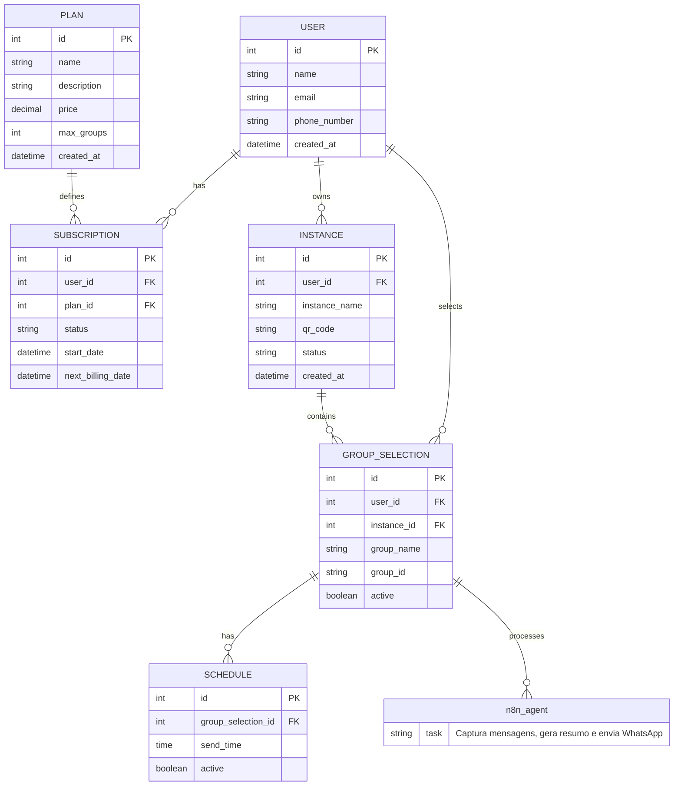

# PRD - SaaS de Resumo de Conversas WhatsApp

## 1. Visão Geral
O produto é um SaaS que gera resumos automáticos de grupos do WhatsApp via integração com a Evolution API. O usuário contrata um plano de assinatura mensal, conecta sua instância do WhatsApp no sistema, escolhe quais grupos deseja monitorar e recebe os resumos diretamente em seu WhatsApp no horário configurado. O n8n atua como backend de automação, capturando mensagens, gerando resumos e enviando para o cliente.

## 2. Objetivos do Produto
- Facilitar a leitura de grupos movimentados do WhatsApp.
- Criar solução SaaS escalável com cobrança recorrente.
- Entregar MVP simples e funcional com automação via n8n.

## 3. Público-Alvo
- Profissionais em grupos grandes (trabalho, estudo, networking).
- Pequenas empresas usando WhatsApp internamente.
- Administradores de comunidades que querem acompanhar conversas sem perder detalhes.

## 4. Principais Funcionalidades (MVP)

### 4.1 Onboarding e Instância WhatsApp
- Cadastro no sistema.
- Escolha de plano e pagamento (via Asaas).
- Criação automática de instância na Evolution API.
- Geração de QRCode para conectar o WhatsApp.
- Status da instância: Conectado / Desconectado.

### 4.2 Seleção de Grupos
- Listar grupos do WhatsApp conectados via Evolution API.
- Seleção do(s) grupo(s) para resumir.
- Configuração do horário de envio do resumo.

### 4.3 Geração de Resumos (via n8n)
- Captura das mensagens do grupo pelo n8n.
- Mensagens salvas temporariamente no Supabase apenas para processar o resumo.
- Resumo gerado pela IA (OpenAI API).
- Resumo não exibido nem salvo permanentemente.
- Envio automático do resumo para WhatsApp do cliente via Evolution API.

### 4.4 Assinatura & Pagamento
- Integração com Asaas para gestão de assinaturas e cobrança recorrente.
- Planos mensais:
  - Básico → 1 grupo
  - Pro → até 5 grupos
- Renovação automática e gestão de status (Ativo / Inadimplente / Cancelado).

## 5. Requisitos Técnicos
### 5.1 Stack
- Frontend: Next.js (VPS)
- Backend/Automação: n8n (agente de resumo)
- Banco de dados: Supabase
- Integração WhatsApp: Evolution API
- IA: OpenAI API
- Pagamentos: Asaas
- IDE: Cursor

### 5.2 Arquitetura Básica
1. Usuário cria conta → Escolhe plano → Pagamento via Asaas.
2. Sistema cria instância na Evolution → Gera QRCode.
3. Cliente conecta WhatsApp → Status conectado.
4. Usuário escolhe grupos → Configura horário de envio.
5. n8n captura mensagens → gera resumo → envia para WhatsApp do cliente.

## 6. Fluxo do Usuário (MVP)
1. Cadastro/Login
2. Escolha do plano + Pagamento via Asaas
3. Onboarding → QRCode Evolution → Conexão WhatsApp
4. Listar grupos → Selecionar grupo(s) para resumo
5. Configurar horário de envio
6. Resumo gerado e entregue automaticamente via WhatsApp (via n8n)

## 7. Roadmap MVP
1. Setup Next.js + Supabase.
2. Integração Asaas (assinaturas + webhook).
3. Integração Evolution API (instância + QRCode + envio de mensagens).
4. Configuração do n8n para automação:
   - Captura mensagens
   - Salva temporariamente no Supabase
   - Gera resumo com IA
   - Envia para WhatsApp
5. Listagem de grupos e seleção pelo usuário.
6. Configuração de horários de envio.
7. Deploy em VPS.

## 8. Futuras Funcionalidades (Pós-MVP)
- Suporte a múltiplos horários por grupo.
- Estilos de resumo diferentes (curto, detalhado, tópicos).
- Relatórios semanais/mensais.
- Multiusuário (uma conta gerencia vários clientes).
- Exportação de resumos para PDF.

## 9. Métricas de Sucesso
- Número de assinaturas ativas.
- Retenção de clientes (churn rate).
- Número de grupos configurados por cliente.
- Feedback de qualidade dos resumos.

## 10. Riscos & Desafios
- Instabilidade da Evolution API.
- Custos de IA dependendo do volume de mensagens.
- Privacidade e compliance com dados dos grupos.
- Pagamentos e inadimplência via Asaas.
- Orquestração n8n: garantir execução confiável de automações.

## 11. Identidade Visual e Paleta de Cores
O design do MVP será limpo, moderno e simples, inspirado na interface do WhatsApp.

### Paleta de Cores
| Propósito          | Cor Hex    | Uso sugerido |
|-------------------|-----------|--------------|
| Verde principal    | #25D366   | Botões, destaques, ícones principais |
| Verde escuro       | #128C7E   | Headers, rodapés, textos de destaque |
| Cinza claro        | #ECE5DD   | Backgrounds de cards ou seções secundárias |
| Cinza médio        | #AAAAAA   | Textos secundários, placeholders |
| Branco             | #FFFFFF   | Background principal, textos claros sobre verde escuro |
| Preto / Grafite    | #111B21   | Textos principais, títulos |

### Diretrizes de aplicação
- #25D366 para botões de ação, links importantes e elementos de destaque.
- #128C7E para barras de navegação, headers e elementos fixos.
- #ECE5DD como fundo de cards ou seções de seleção de grupos.
- #AAAAAA para textos secundários e informações complementares.
- #FFFFFF como fundo geral, garantindo contraste.
- #111B21 para títulos e textos de destaque, garantindo legibilidade.

## 12. DER (Resumo Estrutural)

